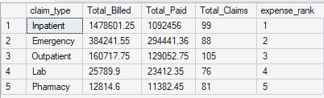
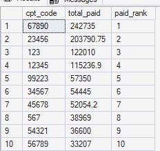
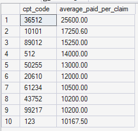
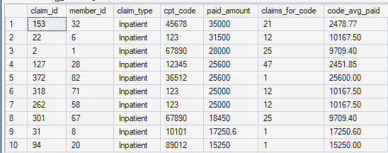

# Healthcare Claims Analysis

A SQL analysis of 449 health insurance claims, looking at where the money goes: by claim type, by procedure (CPT code) and by diagnosis (ICD code), and how much of total spend sits in a small number of very large claims.

**Tools:** SQL Server (T-SQL) · Power BI dashboard planned

## Key findings

- **Inpatient care drives the cost.** Inpatient claims are 22% of claims but 70% of the 1.55 million paid. Pharmacy is 18% of claims and under 1% of spend.
- **Spend is concentrated in a few codes.** The top 10 CPT codes account for 62% of total paid, and the top 10 ICD codes for 60%. Hypertension (I10) is the costliest diagnosis code.
- **Ten claims carry 16% of all spend.** The 10 largest claims are just 2% of claims, and all ten are inpatient.
- **The "highest average" list is mostly one-off claims.** 9 of the 10 CPT codes with the highest average paid per claim appear on a single claim.
- **Some big claims sit far above their code's norm.** The largest claim (35,000) was paid 14 times the average for its CPT code.

## Dataset

| Table | Rows | Columns |
|---|---|---|
| `claims` | 449 | `claim_id`, `member_id`, `provider_id`, `claim_date`, `claim_type`, `cpt_code`, `icd_code`, `billed_amount`, `paid_amount` |
| `members` | 100 | `member_id`, `member_age`, `member_gender`, `plan_type`, `enrollment_start_date`, `enrollment_end_date` |

The analysis so far uses the `claims` table. Claim types are Inpatient, Outpatient, Emergency, Lab and Pharmacy. Across all claims, 2.06 million was billed and 1.55 million paid.

## Analysis

All queries are in [`Healthcare Claims.sql`](Healthcare%20Claims.sql).

### 1. Cost by claim type

Total billed, total paid and number of claims for each claim type, ranked by total paid with `RANK()`.



| Claim type | Share of claims | Share of total paid | Avg paid per claim |
|---|---:|---:|---:|
| Inpatient | 22.0% | 70.4% | 11,034.91 |
| Emergency | 19.6% | 19.0% | 3,345.92 |
| Outpatient | 23.4% | 8.3% | 1,229.07 |
| Lab | 16.9% | 1.5% | 308.06 |
| Pharmacy | 18.0% | 0.7% | 140.52 |

Outpatient is the most common claim type but only third by cost. An average inpatient claim is paid about nine times as much as an average outpatient one.

### 2. Top 10 CPT codes by total paid



- These 10 codes account for 61.7% of all money paid. The top two, 67890 and 23456, account for 28.8% on their own.
- Two of the ten, 123 (#3) and 567 (#8), aren't valid CPT codes as written (see [Data quality notes](#data-quality-notes)).

### 3. Top 10 ICD codes by total paid

| Rank | ICD code | Total paid |
|---:|---|---:|
| 1 | I10 | 259,566.00 |
| 2 | A12.3 | 152,147.00 |
| 3 | B20 | 140,990.00 |
| 4 | B20.1 | 105,210.00 |
| 5 | C34.91 | 62,905.00 |
| 6 | B99.4 | 51,000.00 |
| 7 | E11.65 | 50,512.00 |
| 8 | J45.909 | 44,465.56 |
| 9 | E11.9 | 34,766.00 |
| 10 | A01.1 | 34,260.00 |

- These 10 codes account for 60.3% of total paid.
- Closely related codes appear separately: B20 and B20.1 at #3 and #4, and E11.65 and E11.9 at #7 and #9. Rolling codes up to their category would combine them (see [Next steps](#next-steps)).

### 4. CPT codes with the highest average paid per claim

Average paid per claim = total paid ÷ number of claims, for each CPT code.



9 of these 10 codes appear on just one claim, so their "average" is simply that claim's amount. Only 123 (12 claims, average 10,167.50) is expensive across several claims. That's why the next query looks at the largest claims one by one.

### 5. The 10 largest individual claims

Each claim's paid amount, shown with how many claims share its CPT code and that code's average paid, using window functions partitioned by `cpt_code`:

```sql
SELECT TOP 10
       claim_id, member_id, claim_type, cpt_code, paid_amount,
       COUNT(*) OVER (PARTITION BY cpt_code) AS claims_for_code,
       CAST(AVG(paid_amount) OVER (PARTITION BY cpt_code) AS DECIMAL(10,2)) AS code_avg_paid
FROM claims
ORDER BY paid_amount DESC;
```



- The 10 largest claims total 246,650.60: 15.9% of all money paid, from 2.2% of claims. All ten are inpatient.
- Only three of them (codes 36512, 10101 and 89012) are on codes that appear once. The rest are on common codes, where an average hides them. Claim 153 was paid 35,000 against an average of 2,478.77 for code 45678 (14×), and claim 127 was paid 25,600 against 2,451.85 for code 12345 (10×). Claims that far above their code's average are the kind an insurer would review.
- Three of the ten carry code 123, which isn't a valid CPT code as written.

## Data quality notes

The results above use the data as supplied. These issues are flagged rather than fixed:

- **Invalid CPT codes.** CPT codes are five characters long. 77 claims (18.9% of total paid) have a code that can't be valid as written: too short (123, 567), too long (210090) or text such as GPI1234. Some may be codes that lost their leading zeros when stored as numbers in Excel (00123 becomes 123).
- **Malformed ICD codes.** Two codes have the decimal point missing or in the wrong place (A123 and A123.4).
- **Dates need fixing, not just converting.** `claim_date` is a mix of true dates and text. Every text date has a day above 12 (for example 7/22/2023), and every true date has a day of 12 or below. That's what Excel does when it opens US-style M/D/YYYY dates with UK date settings: it converts the ones it can read as D/M, swapping day and month, and leaves the rest as text. So the converted dates probably have their day and month the wrong way round. The enrollment dates in `members` show the same pattern.
- **Otherwise clean.** There are no duplicate claims, no missing amounts, and no claim is paid more than its billed amount.

## Next steps

- **Member-level analysis:** total paid per member, the highest-cost members, and which claim types drive their costs.
- **Billed vs paid:** paid ÷ billed, compared by claim type, provider and CPT code.
- **Power BI dashboard** built on the same data.
- **Refinements:** add a minimum claim count to the average-paid query, to separate consistently expensive procedures from one-off claims, and roll ICD codes up to their three-character category (for example, B20 and B20.1 into B20).

## Repository structure

```
├── Healthcare Claims.sql   # all queries
├── README.md
└── images/                 # query result screenshots
```
